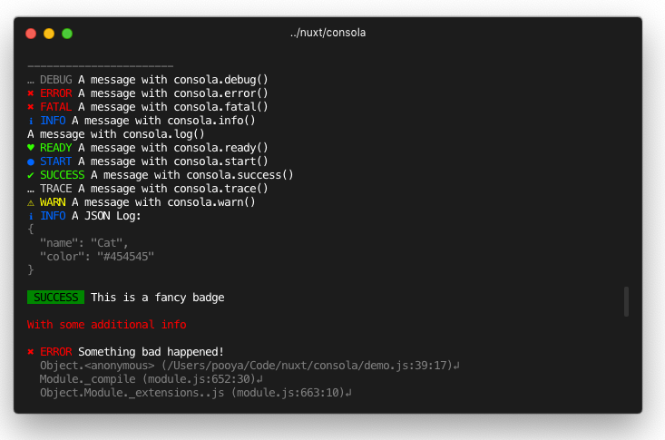

# 🎮  Consola

[![Standard JS][standard-js-src]][standard-js-href]
[![npm version][npm-version-src]][npm-version-href]
[![npm downloads][npm-downloads-src]][npm-downloads-href]

> Elegant Console Logger

## Why Consola?

- Easy to use
- Fancy output with fallback for continuous integration (CI) environments
- Global mockable stdout/stderr wrapper
- Pluggable reporters
- Consistent command line interface (CLI) experience
- Tag support

## Installation

Using yarn:

```bash
yarn add consola
```

Using npm:

```bash
npm i consola
```

## Getting Started

```js
const consola = require('consola')

// See types section for all available types
consola.start('Starting build')
consola.success('Built!')
consola.info('Reporter: Some info')
consola.error(new Error('Foo'))
```

<div align="center">
<br>

<p>Fancy Reporter</p>
<br>
</div>

<pre>
[20:15:57] [DEBUG] A message with consola.debug()
[20:15:57] [ERROR] A message with consola.error()
[20:15:57] [FATAL] A message with consola.fatal()
[20:15:57] [INFO] A message with consola.info()
[20:15:57] [LOG] A message with consola.log()
[20:15:57] [INFO] A JSON Log:
{
  "name": "Cat",
  "color": "#454545"
}
[18:40:19] [ERROR] Something bad happened!
> Object.<anonymous> (consola/demo.js:30:17)
> Module._compile (module.js:652:30)
> Object.Module._extensions..js (module.js:663:10)
</pre>
<div align="center">
  <p>Minimal Reporter (CI)</p>
  <br>
</div>

## Reporters

Choose between one of the built-in reporters or bring own reporter.

By default `FancyReporter` is registered for modern terminals or `BasicReporter` will be used if running in limited environments such as CIs.

Available reporters:

- [BasicReporter](./src/reporters/basic.js)
- [FancyReporter](./src/reporters/fancy.js)
- [JSONReporter](./src/reporters/json.js)
- [WinstonReporter](./src/reporters/winston.js)

### Creating your own reporter

A reporter (Class or Object) exposes `log(logObj)` method.
To write a reporter, check implementations to get an idea.

## Types

Types can be treated as _extended logging levels_ in Consola's world.

A list of all available default types is [here](./src/types.js).

## Creating a new instance

Consola has a global instance and is recommended to use everywhere.
In case more control is needed, create a new instance.

```js
const { Consola, BasicReporter } = require('consola')


const consola = new Consola({
    // level: 4,
    // types: [],
    reporters: [
      new BasicReporter
    ],
    defaults: {
      additionalColor: 'white'
    }
})

```

## Methods

- `consola.<type>(logObj)`
- `consola.<type>(args...)`

Log to all reporters.

- `addReporter(reporter)`

Register a custom reporter instance.

- `removeReporter(reporter?)`

Remove a registered reporter.

If no arguments are passed all reporters will be removed.

- `create(options)`

Create a new `Consola` instance and inherit all parent options for defaults.

## Fields

- `reporters`

An array of active reporters.

- `level`

The level to display logs. Any logs at or above this level will be displayed.
List of available levels [here](./src/types.js)

You can set log level using `CONSOLA_LEVEL` environment variable.

## logObject

logObject is a free-to-extend object which will be passed to reporters.

Here are standard possible fields:

Common fields:

- `additional`
- `additionalColor`
- `args`
- `date`
- `message`
- `tag`

Extended fields:

- `badge`
- `clear`
- `icon`

## Integrations

### With jest

```js
consola.removeReporter().addReporter({
  log: jest.fn()
})
```

### With jsdom

```js
{
  virtualConsole: new jsdom.VirtualConsole().sendTo(consola)
}
```

## License

MIT - Made with 💖 By Nuxt.js team!

<!-- Refs -->
[standard-js-src]: https://flat.badgen.net/badge/code%20style/standard/green
[standard-js-href]: https://standardjs.com
[npm-version-src]: https://flat.badgen.net/npm/v/consola/latest
[npm-version-href]: https://npmjs.com/package/consola
[npm-downloads-src]: https://flat.badgen.net/npm/dt/consola
[npm-downloads-href]: https://npmjs.com/package/consola
