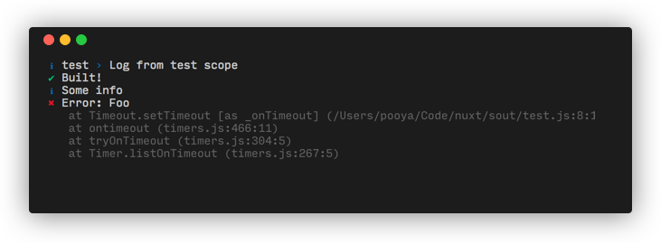

# Consola

Elegant Console Logger

## Why Consola?

- Easy to use
- Fancy output with Fallback for Continuous Integration (CI) environments
- Global mockable stdout/stderr wrapper
- Pluggable reporters
- Consistent Command Line Interface (CLI) experience
- Scoped Loggers

## Installation

Using yarn:

```bash
yarn add consola
```

Using npm:

```bash
npm i consola
```

## Getting started

```js
const consola = require('consola')

// See types section for all available types
consola.start('Starting build')
consola.success('Built!')
consola.info('Reporter: Some info')
consola.error(new Error('Foo'))
```

<div align="center">
<br>

<p>Fancy Reporter</p>
<br>
</div>

<pre>
[2:17:17 PM] Starting build
[2:17:17 PM] [TEST] Log from test scope
[2:17:18 PM] Built!
[2:17:18 PM] Some info
[2:17:18 PM] Error: Foo
</pre>
<div align="center">
<p>Minimal Reporter (CI)</p>
<br>
</div>

## Scoped Loggers

Group logs using an scope:

```js
const logger = consola.withScope('test')

logger.info('Log from test scope') // [Test] Log from test scope
```

## Reporters

Choose between one of the built-in reporters or bring own reporter.

By default `FancyReporter` is registered for modern terminals or `BasicReporter` will be used if running in limited environments such as CIs.

Available reporters:

- [BasicReporter](./src/reporters/basic.js)
- [FancyReporter](./src/reporters/fancy.js)
- [JSONReporter](./src/reporters/json.js)
- [WinstonReporter](./src/reporters/winston.js)

Please see [Examples](./examples) for usage info.

### Creating your own reporter

A reporter (Class or Object) exposes `log(logObj)` method.
To write a reporter, check implementations to get an idea.

## Types

Types can be treated as _extended logging levels_ in Consola's world.

A list of all available default types is [here](./src/types.js).

## Creating a new instance

Consola has a global instance and is recommended to use everywhere.
In case more control is needed, create a new instance.

```js
const { Consola, BasicReporter } = require('consola')


const consola = new Consola({
    level: 30,
    reporters: [],
    types: []
})

consola.add(BasicReporter)
```

## API

- `consola.<type>([logObj|message|error])`

Log to all reporters. If a plain string or error is given, then the message will be automatically translated to a logObject.

- `add(reporter)`

Register a custom reporter instance.

- `remove(reporter)`

Remove a registered reporter.

- `clear()`

Remove all current reporters (Useful for writing tests).

- `withDefaults(defaults)`

Create a wrapper interface with all types available and `defaults` applied to all logs.

- `withScope(scope)`

Shortcut to `withDefaults({ scope })`.

- `level`

The level to display logs. Any logs at or above this level will be displayed.  
List of available levels [here](./src/types.js)

## logObject

logObject is a free-to-extend object which will be passed to reporters.

Here are standard possible fields:

Common fields:

- `message`
- `date`
- `scope`

Extended fields:

- `clear`
- `badge`
- `additional`
- `additionalStyle` (By default: `grey`)
- `icon` (Default depends on log type)

## Integrations

### With jest

```js
consola.clear().add({
  log: jest.fn()
})
```

### With jsdom

```js
{
  virtualConsole: new jsdom.VirtualConsole().sendTo(consola)
}
```

## License

MIT
